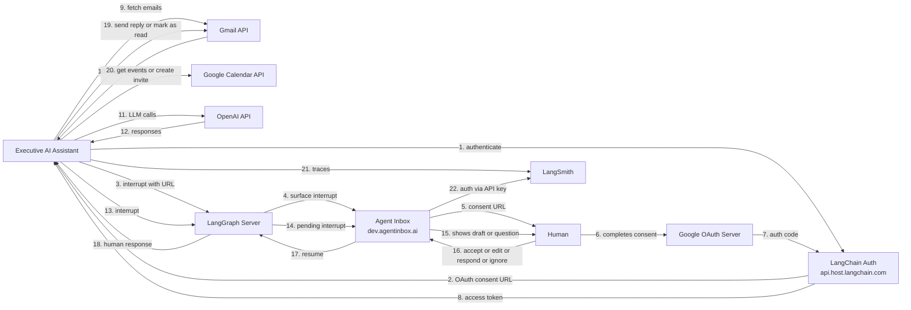

# Architecture Diagram

## Traffic Flow

## Flow Description

| Step | From | To | Description |
|------|------|----|-------------|
| 1 | EAI | LangChain Auth | Request Google OAuth token |
| 2 | LangChain Auth | EAI | Return OAuth consent URL (if no cached token) |
| 3 | EAI | LangGraph Server | Throw interrupt with consent URL |
| 4 | LangGraph Server | Agent Inbox | Surface interrupt to inbox UI |
| 5 | Agent Inbox | Human | Display consent URL |
| 6 | Human | Google OAuth Server | Complete consent in browser |
| 7 | Google OAuth Server | LangChain Auth | Return auth code, exchange for token |
| 8 | LangChain Auth | EAI | Return Google access token |
| 9 | EAI | Gmail API | Fetch new emails |
| 10 | Gmail API | EAI | Return email threads |
| 11 | EAI | OpenAI API | LLM calls for triage, draft, rewrite, reflect |
| 12 | OpenAI API | EAI | LLM responses |
| 13 | EAI | LangGraph Server | Throw interrupt for human review |
| 14 | LangGraph Server | Agent Inbox | Expose pending interrupt |
| 15 | Agent Inbox | Human | Show email draft, question, or notification |
| 16 | Human | Agent Inbox | accept / edit / respond / ignore |
| 17 | Agent Inbox | LangGraph Server | Resume graph with human response |
| 18 | LangGraph Server | EAI | Deliver human response to graph |
| 19 | EAI | Gmail API | Send reply or mark as read |
| 20 | EAI | Google Calendar API | Get events or create calendar invite |
| 21 | EAI | LangSmith | Send traces and logs |
| 22 | Agent Inbox | LangSmith | Authenticate via LangSmith API key |
